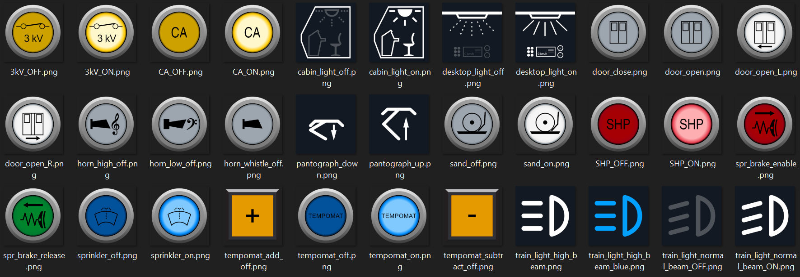
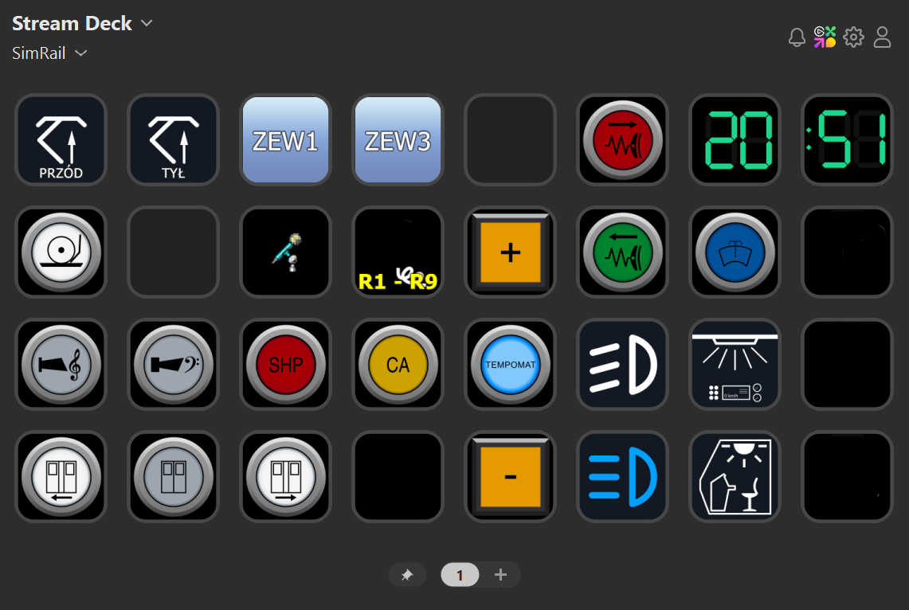

# StreamDeck-SimRail-IconPack

StreamDeck icons for SimRail - The Railway Simulator

I've created these icons to use them in my Stream Deck (XXL version). In [SimRail - The Railway Simulator](https://store.steampowered.com/app/1422130/SimRail__The_Railway_Simulator/) you can set your own keybind to some in-game actions, and then set them in Stream Deck. Of course there were no icons pack to match this simulator, so I've created them by myself.
## Authors

- [@barterbly](https://www.github.com/barterbly)
## Screenshots

## FAQ (work in progress)

#### What is the icons size, color depth and format?

833px x 833px, 64-bit depth, PNG

#### Is there possibility to generate different size / format of these icons?

Yes. You can contact me and let me know, what size / format you would like to have. If I have free time, I'll generate them. The best way is to create thread in Discussion section of this repository.

#### Will there be other icons?

Yes. I'll try to make other icons and also in different style to fit other locos.

#### License

<a property="dct:title" rel="cc:attributionURL" href="https://github.com/Barterbly/StreamDeck-SimRail-IconPack">Stream Deck SimRail Icon Pack</a> by  <a href="https://www.github.com/barterbly">Barterbly</a> is licensed under <a href="https://creativecommons.org/licenses/by-nc-nd/4.0/?ref=chooser-v1" target="_blank" rel="license noopener noreferrer" style="display:inline-block;">Creative Commons Attribution-NonCommercial-NoDerivatives 4.0 International</a>

